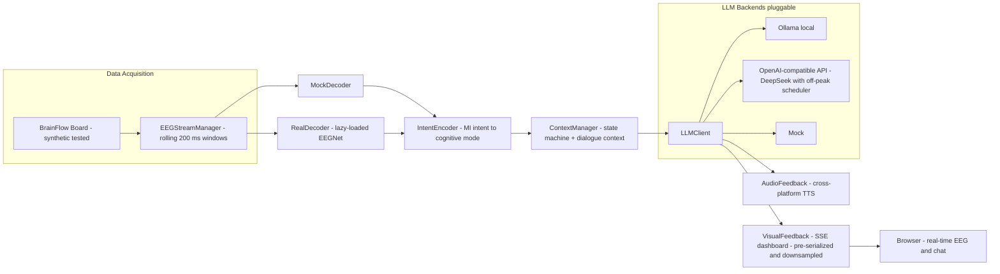

# NeuroDecode - EEG Motor Imagery Decoding System

[](https://github.com/Viandanze/NeuroDecode/actions/workflows/tests.yml)

A comprehensive toolkit for EEG-based Motor Imagery classification, implementing deep learning, classical ML, and ensemble approaches with real-time BrainFlow streaming support.

**Status: feature-complete.** All planned modules are implemented and validated (239 tests green on GitHub Actions CI); no further phases are planned.

##  Project Overview

This project provides complete implementations of:
- **EEGNet v2** - Compact CNN for EEG classification (Lawhern et al. 2018)
- **Conformer** - Transformer-based EEG classifier
- **TCN** - Temporal Convolutional Network for time-series EEG
- **CSP** - Common Spatial Pattern (classical BCI approach)
- **Riemannian MDM** - Covariance-based classification using Riemannian geometry
- **Ensemble** - Voting & Stacking with tangent space features
- **BrainFlow Real-Time Pipeline** - Streaming via BrainFlow; tested on the synthetic board, real board IDs pluggable

### Verified Results (PhysioNet Motor Movement: 109-subject dataset, 64ch, 160Hz; results verified on an 8-subject subset)

| Model | Evaluation | Accuracy | Notes |
|-------|-----------|----------|-------|
| EEGNet v2 (baseline) | 5-fold CV | 45.83% | 4-class (25% random) |
| EEGNet v2 (tuned) | 5-fold CV | 54.32% | Hyperparameter search |
| Conformer | 5-fold CV | 38.43% | |
| TCN | 5-fold CV | 40.35% | |
| Ensemble Voting(soft) | train/test split | 79.29% | EEGNet+Conformer+TCN |
| **Ensemble Stacking(tangent)** | **train/test split** | **82.14%** | **Cohen's Kappa 0.537** |
| Riemannian MDM | single subject | 73.63% | |

##  System Architecture



##  Project Structure

```
NeuroDecode/
鈹溾攢鈹€ src/                          # Core package
鈹?  鈹溾攢鈹€ config.py                 # Configuration management (YAML + defaults)
鈹?  鈹溾攢鈹€ data/                      # Data loading and preprocessing
鈹?  鈹?  鈹溾攢鈹€ loader.py             # PhysioNet dataset loader
鈹?  鈹?  鈹斺攢鈹€ preprocessing.py      # EEG preprocessing pipeline
鈹?  鈹溾攢鈹€ models/                    # ML models
鈹?  鈹?  鈹溾攢鈹€ eegnet.py             # EEGNet v2 implementation
鈹?  鈹?  鈹溾攢鈹€ conformer.py          # Conformer model
鈹?  鈹?  鈹溾攢鈹€ tcn.py                # TCN model
鈹?  鈹?  鈹溾攢鈹€ ensemble.py           # Voting & Stacking ensemble
鈹?  鈹?  鈹溾攢鈹€ csp.py                # CSP classifier
鈹?  鈹?  鈹斺攢鈹€ riemann_mdm.py        # Riemannian MDM classifier
鈹?  鈹溾攢鈹€ acquisition/              # Data acquisition (BrainFlow streaming)
鈹?  鈹?  鈹溾攢鈹€ brainflow_acquisition.py  # BrainFlow board wrapper (synthetic default)
鈹?  鈹?  鈹斺攢鈹€ eeg_stream_manager.py     # Rolling-window EEG stream manager (200ms batch push)
鈹?  鈹溾攢鈹€ decoders/                 # EEG decoders
鈹?  鈹?  鈹溾攢鈹€ mock_decoder.py       # Mock decoder for testing
鈹?  鈹?  鈹斺攢鈹€ real_decoder.py       # EEGNet-based real decoder with auto-architecture inference
鈹?  鈹溾攢鈹€ training/                 # Training utilities
鈹?  鈹?  鈹溾攢鈹€ trainer.py            # Unified training loop
鈹?  鈹?  鈹斺攢鈹€ augment.py            # Data augmentation (6 methods)
鈹?  鈹溾攢鈹€ inference/                # Real-time inference
鈹?  鈹?  鈹斺攢鈹€ pipeline.py           # StreamingBuffer + RealTimePipeline
鈹?  鈹溾攢鈹€ evaluation/               # Metrics
鈹?  鈹?  鈹斺攢鈹€ metrics.py            # Comprehensive evaluation
鈹?  鈹溾攢鈹€ intent/                    # Intent encoding
鈹?  鈹?  鈹溾攢鈹€ intent_encoder.py     # MI to cognitive mode mapping
鈹?  鈹?  鈹斺攢鈹€ context_manager.py    # State machine + dialogue context
鈹?  鈹溾攢鈹€ llm_bridge/               # LLM integration
鈹?  鈹?  鈹斺攢鈹€ llm_client.py         # Ollama/API/Mock pluggable backend
鈹?  鈹溾攢鈹€ feedback/                 # Visual feedback
鈹?  鈹?  鈹斺攢鈹€ visual_feedback.py    # Flask+SSE real-time web UI
鈹?  鈹斺攢鈹€ utils/                    # Utilities
鈹?      鈹斺攢鈹€ config.py             # Configuration management
鈹溾攢鈹€ tests/                       # Unit tests
鈹?  鈹溾攢鈹€ test_intent_encoder.py   # Intent encoder tests
鈹?  鈹溾攢鈹€ test_context_manager.py  # Context manager tests
鈹?  鈹溾攢鈹€ test_llm_client.py       # LLM client tests
鈹?  鈹溾攢鈹€ test_config.py           # Config module tests
鈹?  鈹溾攢鈹€ test_eeg_stream_manager.py  # EEG stream manager tests
鈹?  鈹斺攢鈹€ test_decoders.py         # Decoder module tests
鈹溾攢鈹€ scripts/                      # Executable scripts
鈹?  鈹溾攢鈹€ realtime_demo.py          # Real-time pipeline demo - mock stream or trained model
鈹?  鈹溾攢鈹€ collaborative_reasoning_demo.py  # BCI脳LLM collaborative demo
鈹?  鈹溾攢鈹€ train_eegnet.py           # EEGNet training (with anti-collapse measures)
鈹?  鈹溾攢鈹€ train_ensemble.py         # Ensemble training
鈹?  鈹溾攢鈹€ train_csp.py              # CSP training
鈹?  鈹溾攢鈹€ train_riemann.py          # Riemannian training
鈹?  鈹溾攢鈹€ compare_models.py         # Model comparison
鈹?  鈹斺攢鈹€ tune_eegnet.py            # Hyperparameter tuning
鈹溾攢鈹€ visualizations/               # Charts (CN + EN)
鈹溾攢鈹€ configs/                      # Configuration files
鈹?  鈹溾攢鈹€ default.yaml              # Default training configuration
鈹?  鈹斺攢鈹€ phase1.yaml               # Collaborative reasoning runtime config (legacy filename)
鈹溾攢鈹€ outputs/                      # Results and checkpoints
鈹溾攢鈹€ README.md                     # This file
鈹斺攢鈹€ requirements.txt              # Python dependencies
```

## 馃敡 Installation

### Prerequisites

```bash
# Create conda environment (if not already done)
conda create -n bci_dev python=3.10
conda activate bci_dev

# Install PyTorch
pip install torch>=2.0.0

# Install MNE and dependencies
pip install mne>=1.0.0 scipy>=1.7.0 numpy>=1.21.0

# Install scikit-learn
pip install scikit-learn>=1.0.0

# Install pyRiemann (for Riemannian classifiers)
pip install pyriemann>=0.3.0

# Install Braindecode (optional, for additional models)
pip install braindecode>=0.8.0

# Install other utilities
pip install pyyaml matplotlib tqdm
```

### Quick Install

```bash
cd NeuroDecode
pip install -r requirements.txt
```

##  Quick Start

### 1. Download PhysioNet Dataset

The first time you run a script, MNE will attempt to download the PhysioNet Motor Movement/Imagery dataset. This requires internet access.

```bash
python scripts/train_eegnet.py --subjects 1 2 3
```

### 2. Train EEGNet

```bash
# Basic training (with anti-collapse measures enabled by default)
python scripts/train_eegnet.py --subjects 1 2 3 --epochs 100

# Disable augmentation
python scripts/train_eegnet.py --subjects 1 2 --no_augment --epochs 100

# With cross-validation
python scripts/train_eegnet.py --subjects 1 --cv_folds 5
```

### 3. Train CSP

```bash
python scripts/train_csp.py --subjects 1 2 3 --n_components 4
```

### 4. Train Riemannian MDM

```bash
python scripts/train_riemann.py --subjects 1 2 --metric riemann
```

### 5. Compare Models

```bash
python scripts/compare_models.py --subjects 1 2 3 --quick
```

### 6. Hyperparameter Tuning

```bash
# Run all strategies
python scripts/tune_eegnet.py --all --subjects 1 2

# Run specific strategy
python scripts/tune_eegnet.py --strategy A --augmentations gaussian_noise mixup
python scripts/tune_eegnet.py --strategy B --full_search
python scripts/tune_eegnet.py --strategy C --improvements batchnorm
```

### 7. Real-Time Inference Demo

```bash
# Simulated streaming data, no hardware needed
python scripts/realtime_demo.py --mock --duration 60

# Real-time predictions with a trained model
python scripts/realtime_demo.py --model_path models/eegnet.pt --duration 120
```

For hardware acquisition, `BrainFlowAcquisition` accepts a BrainFlow board ID
(defaults to the synthetic board; real boards such as Ganglion/Cyton can be
selected programmatically once the device is connected).

Supports 8 channels at 250Hz, sliding window inference (4s window, 0.5s step). Switch hardware by changing `--board` parameter only.

##  EEGNet Tuning Strategies

### Strategy A: Data Augmentation
Systematically test augmentation methods:
- Gaussian Noise
- Temporal Masking
- Channel Masking
- Time Shifting
- Band Perturbation
- Mixup

### Strategy B: Hyperparameter Grid Search
Search over key parameters:
- F1 (temporal filters): [4, 8, 16]
- D (depth multiplier): [1, 2, 4]
- Dropout: [0.3, 0.5, 0.7]
- Kernel length: [32, 64, 128]

### Strategy C: Architecture Improvements
Test architectural modifications:
- Batch Normalization
- Label Smoothing
- SE Attention
- Combined approaches

### Anti-Collapse Measures

The training script includes built-in measures to prevent prediction collapse:

| Measure | Default | Flag to Disable |
|---------|---------|-----------------|
| Class weighting (balanced) | ON | `--no_class_weighting` |
| Cosine annealing LR scheduler | ON | `--scheduler none` |
| Data augmentation | ON | `--no_augment` |
| Label smoothing (0.1) | ON | `--label_smoothing 0.0` |

These measures work together to ensure balanced predictions across all MI classes.

##  Collaborative Reasoning Module (BCI x LLM)

NeuroDecode bridges BCI motor imagery decoding with LLM-powered collaborative reasoning. Instead of treating BCI as a keyboard (one label = one character), we map MI classes to high-level **cognitive modes**, leveraging the human brain's strength in rapid intuitive selection.

### Architecture

```
EEG Signal -> BrainFlow -> EEGNet Decoder -> IntentEncoder -> ContextManager
                                                              |
                                                    LLM Bridge (Ollama/API/Coze/Mock)
                                                              |
                                                    3 Candidate Responses
                                                              |
                                                    User BCI Selection (2nd round)
                                                              |
                                                    Expand -> Visual Feedback (Flask+SSE)
```

### Cognitive Mode Mapping

| Motor Imagery Class | Cognitive Mode | Description |
|---------------------|---------------|-------------|
| Left Hand | QUERY | Search for knowledge / factual lookup |
| Right Hand | REASON | Logical deduction / calculation / analysis |
| Feet | CREATE | Generate solutions / creative ideas |
| Tongue | REVIEW | Summarize / synthesize current context |

### Quick Start (Mock Mode - No Ollama Required)

```bash
# Install collaborative-reasoning dependencies
pip install -r requirements_phase1.txt

# Run collaborative reasoning demo with mock LLM
python scripts/collaborative_reasoning_demo.py --backend mock

# With trained EEGNet decoder
python scripts/collaborative_reasoning_demo.py --backend mock --real-decoder

# With custom config file
python scripts/collaborative_reasoning_demo.py --config configs/phase1.yaml

# Open browser to http://127.0.0.1:8080
```

### Configuration

All runtime parameters are externalized to `configs/phase1.yaml`. CLI arguments override config values.

| Section | Parameters | Description |
|---------|-----------|-------------|
| `acquisition` | sample_rate, window_size, window_overlap | BrainFlow board settings |
| `eeg_stream` | window_seconds, push_interval, display_channels | Rolling-window EEG display |
| `bci` | debounce_frames, confidence_threshold, selection_timeout | Intent decoding parameters |
| `decoder` | model_sample_rate, bandpass_low/high, n_classes | EEGNet preprocessing config |
| `llm` | default_backend, ollama/api settings | LLM backend configuration (mock/ollama/api/coze) |
| `feedback` | host, port | Web UI server settings |

Edit the YAML file directly, no code changes needed.

### Connecting a Real LLM (Pick a Backend)

The demo works out of the box with canned responses (`--backend mock`).
For real generation, pick **one** of the backends below 鈥?they all implement
the same `LLMClient` interface, so switching is a one-flag change.

| Backend | Setup | Cost | Runs locally? | Best for |
|---------|-------|------|---------------|----------|
| `mock` | none | free | 鈥?| 30-second trial, CI, no LLM at all |
| `ollama` | install Ollama + pull a model | free | yes | privacy, offline use, no API key, own GPU |
| `api` | get an API key | pay-per-token | no (cloud) | best quality, no GPU needed |
| `coze` | deploy a Coze agent + token | per plan | no (cloud) | Coze users, agent-side prompt control |

If the chosen backend is unavailable at startup, the demo **automatically
falls back to mock responses** instead of crashing. Check the terminal banner
and the UI badge to see which backend is actually live (see
[Verify which backend is live](#verify-which-backend-is-live)).

#### Option 1 鈥?Ollama (local, free, private)

1. Install Ollama from <https://ollama.com/download> (Windows / macOS / Linux).
2. Pull a model that fits your RAM / VRAM:

   | Model | Download size | Suggested when |
   |-------|---------------|----------------|
   | `qwen2.5:3b` | ~2 GB | 8 GB RAM, laptops |
   | `qwen2.5:7b` | ~4.7 GB | 16 GB RAM (project default) |
   | `llama3.1:8b` | ~4.9 GB | alternative at the same size |

   ```bash
   ollama pull qwen2.5:7b
   ```

3. Ollama serves on `http://localhost:11434` by default. The desktop app
   starts the server automatically; on a headless server run `ollama serve`.
4. Run the demo:

   ```bash
   python scripts/collaborative_reasoning_demo.py --backend ollama --real-decoder
   ```

   Use `--model` and `--host` to override the model name and server URL.

#### Option 2 鈥?Any OpenAI-compatible API (DeepSeek, OpenAI, Moonshot, vLLM, ...)

Works with every endpoint that implements `/chat/completions`.

1. Create an API key at your provider (e.g. <https://platform.deepseek.com>).
2. Either pass flags directly:

   ```bash
   python scripts/collaborative_reasoning_demo.py \
     --backend api --real-decoder \
     --api-url https://api.deepseek.com/v1 \
     --api-key YOUR_KEY \
     --api-model deepseek-chat
   ```

   ...or keep the key out of your shell history: copy `.env.example` to `.env`
   and fill in the values 鈥?the demo loads `.env` automatically.

   ```bash
   cp .env.example .env   # then edit .env
   python scripts/collaborative_reasoning_demo.py --backend api --real-decoder
   ```

   Common endpoints:

   | Provider | `--api-url` | `--api-model` |
   |----------|-------------|---------------|
   | DeepSeek | `https://api.deepseek.com/v1` | `deepseek-chat` |
   | OpenAI | `https://api.openai.com/v1` | `gpt-4o-mini` |
   | Moonshot Kimi | `https://api.moonshot.cn/v1` | `moonshot-v1-8k` |
   | Local vLLM | `http://localhost:8000/v1` | your served model |

#### Option 3 鈥?Coze agent (relay through a deployed Coze agent)

Instead of calling a raw model endpoint, NeuroDecode can relay prompts to an
agent deployed on Coze (coze.cn / coze.com). The agent forwards the prompt to
its underlying model and returns the answer.

1. Deploy an agent on Coze with a plain LLM-relay prompt.
2. Collect three values: the agent service domain (`https://xxxx.coze.site`),
   the project id, and a personal access token (PAT) or project API token.
3. Copy `.env.example` to `.env` and fill in `COZE_AGENT_DOMAIN`,
   `COZE_PROJECT_ID`, `COZE_API_TOKEN`.
4. Run:

   ```bash
   python scripts/collaborative_reasoning_demo.py --backend coze --real-decoder
   ```

Notes:

- The agent sandbox may sleep after ~1 h of inactivity; the first request
  after an idle period can take noticeably longer (cold start). If you hit
  the LLM wait timeout, add `--llm-wait-timeout 60`.
- Tokens stay in `.env`, which is git-ignored. Never commit real keys.

#### Verify which backend is live

- Terminal banner at startup: `LLM backend: CozeClient OK`
  (or `OllamaClient` / `APIClient` / `MockLLMClient`). A warning line means
  the backend was unreachable and mock fallback is active.
- Web UI: the Pipeline Stats badge and the footer show the live backend
  (COZE / OLLAMA / API / MOCK).

#### Environment variables reference

| Variable | Used by backend | Meaning |
|----------|-----------------|---------|
| `LLM_API_URL` | `api` | OpenAI-compatible endpoint |
| `LLM_API_KEY` | `api` | API key |
| `LLM_API_MODEL` | `api` | Model name |
| `COZE_AGENT_DOMAIN` | `coze` | Agent service domain |
| `COZE_PROJECT_ID` | `coze` | Numeric project id |
| `COZE_API_TOKEN` | `coze` | PAT or project API token |

Precedence: CLI flags > real environment variables > `.env` values.
All secrets live in `.env` (git-ignored); `.env.example` documents every key.

### Running Tests

```bash
pytest tests/ -v
```

The suite covers intent encoder, context manager, LLM client, config, EEG stream manager, and decoder modules (239 tests passing).

### Modules

| Module | File | Description |
|--------|------|-------------|
| Config | `src/config.py` | YAML + defaults deep-merge configuration management |
| BrainFlowAcquisition | `src/acquisition/brainflow_acquisition.py` | BrainFlow board wrapper (synthetic default, pluggable board IDs) |
| EEGStreamManager | `src/acquisition/eeg_stream_manager.py` | Rolling-window EEG stream manager (200ms batch push, OOP design) |
| MockDecoder | `src/decoders/mock_decoder.py` | Mock EEG decoder for testing without trained model |
| RealDecoder | `src/decoders/real_decoder.py` | EEGNet-based decoder with auto-architecture inference + 5-step preprocessing |
| IntentEncoder | `src/intent/intent_encoder.py` | MI classification to cognitive mode mapping with debounce + confidence threshold |
| ContextManager | `src/intent/context_manager.py` | Thread-safe state machine + dialogue context window |
| LLMClient | `src/llm_bridge/llm_client.py` | Pluggable LLM backend: Ollama / OpenAI-compatible API / Coze agent / Mock |
| VisualFeedback | `src/feedback/visual_feedback.py` | Flask + SSE real-time web UI with EEG waveform + candidate cards |
| Demo | `scripts/collaborative_reasoning_demo.py` | Main entry point, orchestrates full collaborative reasoning pipeline |

---

## Performance

Measured on the real code path (`VisualFeedback.update_eeg`) with
`scripts/bench_feedback.py` 鈥?Windows 11, i7-14650HX, 2026-08-19.

**EEG batch producer throughput** (8-channel windows):

| Window size | Downsample 脳1 | Downsample 脳4 | Speedup |
|---|---|---|---|
| 32 脳 8ch | 18,369 ev/s | 59,195 ev/s | 3.2脳 |
| 256 脳 8ch | 2,508 ev/s | 9,673 ev/s | 3.9脳 |
| 512 脳 8ch | 1,251 ev/s | 4,962 ev/s | 4.0脳 |

**SSE payload serialization** (256-sample window, per event):

| Concurrent clients | Naive (serialize per client) | Pre-serialized (serialize once) | Speedup |
|---|---|---|---|
| 1 | 403.3 碌s | 408.8 碌s | ~1.0脳 |
| 2 | 788.7 碌s | 394.1 碌s | 2.0脳 |
| 5 | 1,968.5 碌s | 394.5 碌s | 5.0脳 |

**Network payload**: downsample 脳4 shrinks each EEG batch event by **74.9%**
(17,287 B 鈫?4,343 B for a 256-sample window).

Reproduce with: `python scripts/bench_feedback.py`

---

## Key Features

### Data Augmentation (6+ Methods)
```python
from src.training.augment import EEGAugmentor, AugmentationConfig

config = AugmentationConfig(
    enabled=True,
    temporal_mask={'enabled': True, 'prob': 0.3},
    channel_mask={'enabled': True, 'prob': 0.2},
    gaussian_noise={'enabled': True, 'prob': 0.3, 'snr_db': 10},
    time_shift={'enabled': True, 'prob': 0.2},
    band_perturbation={'enabled': True, 'prob': 0.2},
    mixup={'enabled': True, 'prob': 0.3, 'alpha': 0.2},
)

augmentor = EEGAugmentor(config, sfreq=128)
X_aug = augmentor.augment(X)
```

### Preprocessing Pipeline
```python
from src.data.preprocessing import PreprocessingPipeline, PreprocessingConfig

config = PreprocessingConfig(
    bandpass_low=4,
    bandpass_high=38,
    tmin=-1.0,
    tmax=4.0,
    baseline=(-1.0, 0.0),
    normalize=True,
    resample_freq=128,
)

pipeline = PreprocessingPipeline(config)
epochs = pipeline.process_raw(raw)
```

## Experiment Results

| Model | Evaluation | Accuracy | Notes |
|-------|-----------|----------|-------|
| EEGNet v2 (baseline) | 5-fold CV | 45.83% | 4-class (25% random) |
| EEGNet v2 (tuned) | 5-fold CV | 54.32% | Hyperparameter search |
| Conformer | 5-fold CV | 38.43% | |
| TCN | 5-fold CV | 40.35% | |
| Ensemble Voting(soft) | train/test split | 79.29% | EEGNet+Conformer+TCN |
| **Ensemble Stacking(tangent)** | **train/test split** | **82.14%** | **Cohen's Kappa 0.537** |
| Riemannian MDM | single subject | 73.63% | |

## Configuration

### YAML Configuration

```yaml
# configs/default.yaml
data:
  dataset_path: "./NeuroDecode/data/"
  subjects: [1, 2, 3, 4, 5, 6, 7, 8]
  runs: [4, 5, 6]

preprocessing:
  bandpass_low: 4
  bandpass_high: 38
  normalize: true

eegnet:
  F1: 8
  D: 2
  kernel_length: 64
  dropout_rate: 0.5
  epochs: 100
  batch_size: 64
  learning_rate: 0.001

augmentation:
  enabled: true
  probability: 0.5
  temporal_mask:
    enabled: true
    prob: 0.3
```

## Troubleshooting

### Dataset Download Issues
If the PhysioNet dataset fails to download:
```bash
# Try setting a proxy if behind firewall
# Use synthetic data for testing: scripts will auto-generate if download fails
```

### Out of Memory
```bash
# Reduce batch size
python scripts/train_eegnet.py --subjects 1 --batch_size 32

# Use CPU if GPU memory is limited
python scripts/train_eegnet.py --subjects 1 --device cpu
```

### Import Errors
```bash
# Make sure you're in the project root
cd NeuroDecode
export PYTHONPATH="${PYTHONPATH}:$(pwd)"

# Or run scripts directly
python scripts/train_eegnet.py
```

## References

1. Lawhern, V. J., et al. (2018). EEGNet: A compact convolutional neural network for EEG-based brain-computer interfaces. *Journal of Neural Engineering*.

2. Blankertz, B., et al. (2008). The BCI competition III: Validating alternative approaches to actual EEG problems. *IEEE TNSRE*.

3. Barachant, A., et al. (2012). Classification of covariance matrices using a Riemannian-based kernel for BCI applications. *NeuroImage*.

## License

MIT. This project is for educational and research purposes.
